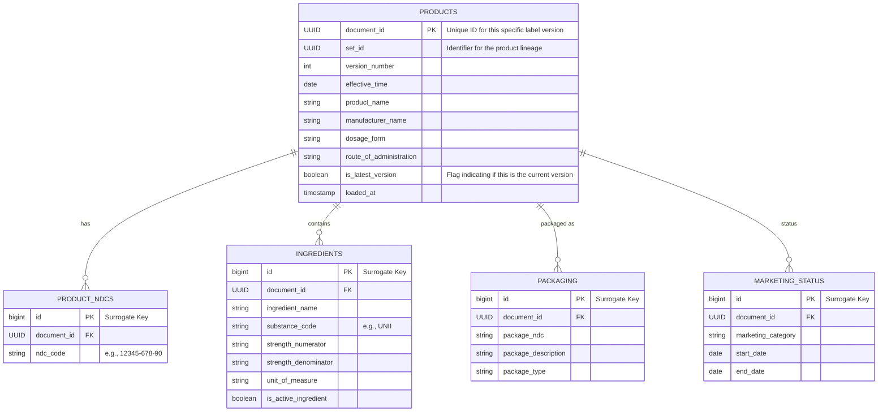

# Functional Requirements Document (FRD): Open-Source Python Package for FDA SPL Data Loading

**Version:** 1.0
**Date:** September 7, 2025
Package Author: Gowtham Rao rao@ohdsi.org
Package name: py_load_spl

As part of the set up you will likely need postgres db in your secure virtual environment.You may need docker.

## 1\. Introduction

### 1.1 Purpose and Scope

This document outlines the functional requirements for an open-source Python package, tentatively named `spl-loader`, designed to extract, transform, and load FDA Structured Product Labeling (SPL) data into relational databases.

The SPL standard, based on the HL7 XML format, is complex and hierarchical. The volume of data provided by the FDA is substantial and updated frequently. The primary purpose of `spl-loader` is to provide a robust, high-performance, and extensible ETL pipeline that makes this critical public health data accessible and queryable in standardized relational formats, utilizing cloud-agnostic principles.

**In Scope:**

  * Downloading and managing SPL archives from the FDA source.
  * Efficient, memory-conscious parsing of SPL XML files.
  * Transformation of key data elements into a normalized relational schema (Standard Representation).
  * Storage of the complete, original XML data for auditing (Full Representation).
  * Generation of optimized intermediate files (e.g., CSV, Parquet) for bulk loading.
  * Implementation of a modular architecture for database loading (Adapter Pattern).
  * Native support for PostgreSQL utilizing the `COPY` command.
  * Mechanisms for both full data synchronization and incremental (delta) updates.

**Out of Scope:**

  * Deep natural language processing (NLP) or extraction from unstructured text sections (e.g., indications, warnings).
  * Providing a web-based user interface or API layer.
  * Direct support for NoSQL databases.

### 1.2 Target Audience

  * **Data Engineers and DBAs:** Professionals integrating public health data into organizational data warehouses or lakehouses.
  * **Pharmaceutical Researchers and Analysts:** Individuals needing queryable SQL access to comprehensive drug labeling data.
  * **Open-Source Contributors:** Developers interested in public health data and robust ETL systems.

### 1.3 Key Goals and Success Metrics

| Goal | Description | Success Metric |
| :--- | :--- | :--- |
| **Performance** | Efficiently process the entire FDA SPL dataset. | Full load completed within [X] hours; Memory usage remains constant and below [Y] GB during parsing. |
| **Extensibility** | Enable easy integration of new database targets. | A new database adapter (e.g., Redshift, BigQuery) can be implemented by adhering to the defined interface within one sprint. |
| **Data Integrity** | Ensure accurate, complete, and atomic data loading. | 100% validation of record counts and checksums between source XML, intermediate files, and target database. |
| **Maintainability**| Ensure long-term viability of the codebase. | 100% MyPy strict type coverage; \>95% unit and integration test coverage. |

## 2\. System Architecture

### 2.1 High-Level Design and Component Overview

The `spl-loader` architecture is designed around a decoupled ETL process. The core principle is the separation of concerns, ensuring that data extraction and transformation logic are independent of the target database implementation.

The system is divided into four main components:

1.  **Acquisition Engine:** Identifies, downloads, verifies, and extracts SPL archives from the FDA source. Manages state for delta loads.
2.  **Parsing Engine:** Iteratively processes individual SPL XML files, maintaining a low memory footprint.
3.  **Transformation Layer:** Maps the parsed XML data into relational models (Standard and Full representations) and generates standardized intermediate files.
4.  **Loading Interface (Database Abstraction Layer):** Defines the contract for data loading. Specific **Database Adapters** implement this interface to utilize native bulk loading utilities.

<!-- end list -->

```mermaid
graph TD
    A[FDA SPL Source] --> B(Acquisition Engine);
    B --> C{Local SPL Archive Storage};
    C --> D(Parsing Engine);
    D --> E(Transformation Layer);
    E --> F{Intermediate Standardized Files<br/>(CSV/Parquet)};

    subgraph Database Loading
        G(Loading Interface/Abstraction)
        F --> G;
        G --> H(PostgreSQL Adapter<br/>- uses COPY);
        G --> I(Redshift Adapter<br/>- uses COPY via S3);
        G --> J(Databricks Adapter<br/>- uses COPY INTO);
    end

    H --> K[(PostgreSQL)];
    I --> L[(Redshift)];
    J --> M[(Databricks)];

    style F fill:#e8f4f8,stroke:#333,stroke-width:2px
```

### 2.2 Modular Design and Database Abstraction (Adapter Pattern)

The separation between database-agnostic data preparation (E\&T) and database-specific loading (L) is achieved using the Adapter Pattern.

A base abstract class (ABC), `DatabaseLoader`, will define the required interface for all adapters.

```python
from abc import ABC, abstractmethod
from pathlib import Path
from typing import Literal

class DatabaseLoader(ABC):

    @abstractmethod
    def initialize_schema(self) -> None:
        """Creates the necessary tables and structures."""
        pass

    @abstractmethod
    def bulk_load_to_staging(self, intermediate_dir: Path) -> int:
        """
        Loads intermediate files into staging tables using native utilities.
        :return: The total number of rows loaded into all staging tables.
        """
        pass

    @abstractmethod
    def pre_load_optimization(self, mode: Literal["full-load", "delta-load"]) -> None:
        """Optional: Drop indexes, disable constraints (for full loads)."""
        pass

    @abstractmethod
    def merge_from_staging(self, mode: Literal["full-load", "delta-load"]) -> None:
        """
        Atomically merges (UPSERT) or swaps (FULL LOAD) data from staging to
        production tables.
        """
        pass

    @abstractmethod
    def post_load_cleanup(self, mode: Literal["full-load", "delta-load"]) -> None:
        """Optional: Rebuild indexes, enable constraints, vacuum/analyze."""
        pass

    @abstractmethod
    def start_run(self, mode: Literal["full-load", "delta-load"]) -> int:
        """
        Creates a new entry in the ETL history table for the current run
        and returns a unique run identifier.
        """
        pass

    @abstractmethod
    def end_run(self, run_id: int, status: str, records_loaded: int, error_log: str | None) -> None:
        """
        Updates the ETL history table for the specified run with its final
        status and metrics.
        """
        pass

    @abstractmethod
    def get_processed_archives(self) -> set[str]:
        """
        Retrieves the set of archive names that have already been
        successfully processed.
        """
        pass

    @abstractmethod
    def record_processed_archive(self, archive_name: str, checksum: str) -> None:
        """
        Records a single archive as successfully processed in the database,
        typically after a successful ETL cycle for that archive.
        """
        pass
```

### 2.3 Extensibility Strategy

To add a new database (e.g., Google BigQuery):

1.  A developer implements a new class (e.g., `BigQueryLoader`) inheriting from `DatabaseLoader`.
2.  The developer implements the required methods, utilizing BigQuery-specific mechanisms (e.g., Load Jobs from GCS).
3.  The new adapter is registered in the package configuration, allowing users to select it via configuration.

## 3\. Functional Requirements

### F001: Data Acquisition

  * **F001.1:** The system must download SPL archives from the official FDA download source or read from a local file path.
  * **F001.2:** The system must verify the integrity of downloaded archives using checksums or validation of the ZIP structure.
  * **F001.3 (Delta Identification):** The system must identify new or updated archives by comparing the source manifest with the `etl_processed_archives` table (see Section 4.3).
  * **F001.4:** The system must efficiently extract the individual SPL XML files from the ZIP archives.

### F002: Data Parsing

  * **F002.1 (Memory Efficiency):** The system must use iterative parsing techniques (e.g., `lxml.etree.iterparse`). The entire XML DOM tree must not be loaded into memory.
  * **F002.2 (Schema Awareness):** The parser must correctly handle the HL7 SPL XML namespaces and hierarchical structure.
  * **F002.3 (Element Extraction):** The system must extract defined elements, including metadata (SetID, DocumentID, Version Number, Effective Time), product details, ingredients, packaging, and marketing information.
  * **F002.4 (Error Handling):** The parser must gracefully handle malformed XML files, logging the error and moving the file to a quarantine directory without stopping the pipeline.

### F003: Data Transformation (Standard Representation)

  * **F003.1:** The system must map the hierarchical XML data elements to the normalized relational schema (Section 4.1).
  * **F003.2 (Normalization):** The system must correctly handle repeating elements (e.g., multiple ingredients) by transforming them into related tables with appropriate foreign keys.
  * **F003.3 (Data Cleaning):** The system must apply basic data cleaning (trimming whitespace, normalizing capitalization for controlled vocabularies, type casting).

### F004: Data Transformation (Full Representation)

  * **F004.1:** The system must capture the complete, original content of the SPL XML file.
  * **F004.2:** The system must link the Full Representation with the Standard Representation using the DocumentID and SetID.
  * **F004.3:** The storage format should be optimized for the target database (e.g., XML or JSONB).

### F005: Intermediate File Generation

  * **F005.1:** The system must generate standardized intermediate files to decouple transformation from loading.
  * **F005.2:** The default format shall be CSV (RFC 4180 compliant), optimized for the specific target database's bulk loader (e.g., using `\N` for NULLs in PostgreSQL COPY).
  * **F005.3 (Extensible Formats):** The architecture must support alternative formats (e.g., Parquet) in future implementations.
  * **F005.4:** Files shall be generated in batches (e.g., chunked by N thousand records) to optimize memory usage and loading efficiency.

### F006: Data Loading (General Requirements)

This applies to all database adapters.

  * **F006.1 (Bulk Loading):** Adapters must utilize the target database's native bulk loading utility. Row-by-row ORM inserts are strictly prohibited for the main data load.
  * **F006.2 (Staging Strategy):** The load process must first load data into staging tables.
  * **F006.3 (Transaction Management & Atomicity):** The move from staging to production tables (Merge/Upsert for delta, Swap/Truncate-Insert for full) must be performed atomically within a single transaction.
  * **F006.4 (Idempotency):** The loading process must be idempotent. Re-running the process on the same input data must not result in duplicate records in the target tables.

### F007: Data Loading (PostgreSQL Adapter)

  * **F007.1:** The PostgreSQL adapter must use the `COPY` command (via `psycopg2.copy_expert` or `asyncpg` equivalent) to load the intermediate CSV files.
  * **F007.2:** The adapter must utilize the `JSONB` data type for storing the Full Representation, optimizing storage and query performance.
  * **F007.3 (Optimization):** For full loads, the adapter shall optionally support temporarily dropping foreign key constraints and indexes, recreating them after the load.

### F008: Configuration and Execution

  * **F008.1 (Configuration Management):** The system must use a clear configuration mechanism (e.g., YAML file and/or environment variables), utilizing `Pydantic V2` for validation and settings management.
  * **F008.2 (Database Connection):** Configuration must include connection details (DSN/credentials) and the selection of the database adapter (e.g., `adapter: postgresql`).
  * **F008.3 (Execution Modes):** The system must support modes: `init` (schema setup), `full-load`, and `delta-load`.
  * **F008.4 (Interfaces):** The package must provide both a CLI (e.g., using `Typer`) and a Python API for programmatic execution.

### F009: Logging and Monitoring

  * **F009.1:** The system must provide detailed, structured logging (JSON format) capturing operational metrics (files processed, records loaded, execution time, memory usage).
  * **F009.2:** Logs must clearly distinguish between INFO, WARNING, and ERROR levels, with configurable verbosity.
  * **F009.3:** Error logs must include sufficient context (file name, XML path, database error message, traceback) for debugging.

## 4\. Data Model (Schema Definition)

This section defines the conceptual schema. Exact DDL will be database-specific.

### 4.1 Standard Representation (Normalized Schema)

This schema captures key, queryable elements in a normalized structure, using the SPL-provided UUIDs as primary identifiers.



### 4.2 Full Representation

This table stores the complete raw data for auditing and deep analysis.

**Table: `spl_raw_documents`**

| Column Name | Data Type (PostgreSQL) | Description |
| :--- | :--- | :--- |
| document\_id | UUID (PK) | The unique identifier for this specific XML document. |
| set\_id | UUID | The identifier for the product lineage. |
| version\_number | INT | The version of the label in this lineage. |
| effective\_time | DATE | The date the label became effective. |
| raw\_data | JSONB (or XML) | The complete content of the SPL file. |
| source\_filename | TEXT | The originating filename and archive path. |
| loaded\_at | TIMESTAMPTZ | When this record was loaded into the database. |

### 4.3 ETL Tracking Schema

Metadata tables to track pipeline executions, manage delta loads, and ensure idempotency.

**Table: `etl_load_history`**

| Column Name | Data Type | Description |
| :--- | :--- | :--- |
| run\_id | BIGINT (PK) | Unique ID for the execution run. |
| start\_time | TIMESTAMPTZ | Start time of the run. |
| end\_time | TIMESTAMPTZ | End time of the run. |
| status | VARCHAR(20) | (e.g., RUNNING, SUCCESS, FAILED) |
| mode | VARCHAR(20) | (e.g., FULL, DELTA) |
| archives\_processed | INT | Number of source archives processed. |
| records\_loaded | BIGINT | Total number of records loaded/updated. |
| error\_log | TEXT | Detailed error message if status is FAILED. |

**Table: `etl_processed_archives`**

| Column Name | Data Type | Description |
| :--- | :--- | :--- |
| archive\_name | TEXT (PK) | The name of the zip archive processed. |
| archive\_checksum | VARCHAR(128) | Checksum of the archive file. |
| processed\_timestamp| TIMESTAMPTZ | When the archive was successfully processed. |

## 5\. Non-Functional Requirements

### 5.1 Performance and Scalability

  * **N001.1 (Memory Constraint):** The parsing and transformation process must operate within a constant memory footprint, regardless of input file size. Memory usage should not exceed 4GB per execution thread.
  * **N001.2 (Load Speed):** The system must maximize the throughput of the target database's bulk loader. The goal is to be constrained by the database I/O, not the Python application logic.
  * **N001.3 (Parallel Processing):** The architecture must support parallel processing during the parsing and transformation phases (E\&T) to utilize multi-core systems effectively.

### 5.2 Reliability

  * **N002.1 (Data Integrity):** The system must ensure end-to-end data integrity. Record counts must be validated at each stage (Source -\> Intermediate -\> Staging -\> Production).
  * **N002.2 (Error Recovery):** The system must be resilient to transient failures (e.g., network interruptions, database connection drops). Retries with exponential backoff must be implemented for network operations.
  * **N002.3 (Atomic Updates):** Data must not be visible in the production tables until the load process is complete and validated, ensuring no partial data is exposed.

### 5.3 Maintainability

  * **N003.1 (Code Quality):** All code must be automatically formatted and linted using `Ruff` and `Black`.
  * **N003.2 (Type Hinting):** Type hinting is mandatory. `MyPy` must be configured in `strict` mode and pass without errors in the CI pipeline.
  * **N003.3 (Documentation):** Comprehensive documentation (e.g., ReadTheDocs) must include architecture overview, API documentation (auto-generated from docstrings), usage examples, and a guide for developing new adapters.
  * **N003.4 (Testing Strategy):** The system must include a comprehensive test suite using `pytest`.
      * *Unit Tests:* Isolated tests for parsing logic and transformation rules.
      * *Integration Tests:* End-to-end pipeline tests, utilizing `testcontainers` to spin up actual database instances (e.g., PostgreSQL).
      * *Test Coverage:* Minimum 95% code coverage is required.

### 5.4 Extensibility

  * **N004.1 (Interface Stability):** The `DatabaseLoader` interface must be clearly defined, stable, and well-documented.
  * **N004.2 (Minimal Dependencies):** The core package must have minimal dependencies. Database-specific drivers (e.g., `psycopg2`, `google-cloud-bigquery`) must be defined as optional extras (e.g., `pip install spl-loader[postgresql]`).

## 6\. Technology Stack and Development Practices

### 6.1 Python Libraries

  * **Core Python Version:** Python 3.10+
  * **XML Parsing:** `lxml` (high performance, iterative parsing support).
  * **Data Acquisition:** `requests` (with `tenacity` for robust retries).
  * **Configuration/Validation:** `Pydantic V2` (settings management and data validation).
  * **CLI:** `Typer`.
  * **Database Drivers (Examples):**
      * PostgreSQL: `psycopg2` (stable synchronous) or `asyncpg` (high-performance async).

### 6.2 Development Workflow Tools

  * **Packaging Standard:** `pyproject.toml` (adhering to PEP 621, 517, 518).
  * **Dependency Management:** `PDM` or `Poetry` (for deterministic builds and modern dependency management).
  * **Testing:** `pytest`, `pytest-cov`, `testcontainers`.
  * **Linting and Formatting:**
      * `Ruff` (fast, comprehensive linting and formatting).
      * `Black` (opinionated code formatting backup).
  * **Type Checking:** `MyPy` (strict mode).
  * **Automation:** `pre-commit` hooks to enforce quality checks locally.

### 6.3 CI/CD Implementation Plan

  * **Platform:** GitHub Actions.
  * **Workflow Triggers:** On every push to `main` and on all Pull Requests.
  * **CI Pipeline Steps:**
    1.  Install dependencies (PDM/Poetry).
    2.  Run static analysis (Ruff, Black, MyPy strict).
    3.  Run unit tests and generate coverage report.
    4.  Run integration tests (spinning up PostgreSQL via `testcontainers`).
  * **CD Pipeline Steps (On Tag/Release):**
    1.  Run the full CI pipeline.
    2.  Build the Python package (wheel and sdist).
    3.  Publish the package to PyPI.
    4.  Publish the documentation.
